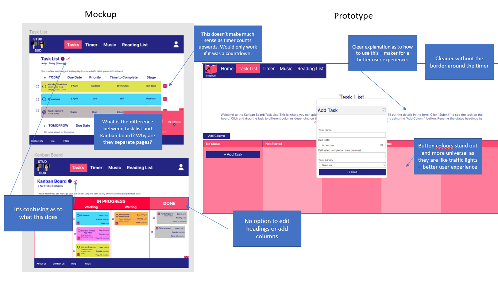

# Development Documentation for StudBud (ague0616)
StudBud is a productivity app designed for students looking to juggle schoolwork with exercise. This is reflected in the landing page with the images of the man working out and the woman studying. I also have set the music playlist to a list of workout tracks to emphasize this.  There have been a lot of iterations and improvements since developing the mockups for the website.

The task list and Kanban board were originally two separate pages – as I conceptualized two different purposes for them; the task list would be for daily tasks and Kanban board for big picture goals. However, after talking with my tutor and some self-reflection, I realized having two pages was extremely redundant and would make it confusing for the users to differentiate which tasks go in what. This would therefore lead to a confusing user experience. Thus my task list is simply in the format of a Kanban board. Furthermore, I did not have the option to add and edit column headings in the mockups. In the final prototype however, there is this option. 

The timer and flow time tracker was also formatted differently. In the mockups, the flow time tracker and stopwatch were on the same page in a blue box with a toggle between the two. However, it seemed more clean to have them on two separate pages under the same drop down. Furthermore, as per my interviews in the previous assignment, one interviewee came up with the idea of having a button next to the task which would take the user to the timer page with the time needed already inputted. However, seeing as the stopwatch is counting upwards, this feature wouldn’t make much sense.

The music list was separated into playlists, albums, songs and artists the user can choose from. However, due to the lack of time I had to include this - I added a workout playlist in my prototype as it fit the theme of the website well. This came from deezer. The widget that was conceptualized in the mockup that displays the music player on every page was sustained in the final prototype, however obviously is styled differently as it is from an external source.

Lastly, the reading list. For the sake of consistency, I formatted it like the task list. Meaning, the user can fill out a form and the title, author, text type and the url appears. 

Overall, I have also understood that users visiting this website from the point of view of someone who hasn’t used a productivity webpage before may not understand how to use all these features. Therefore, I ensured I explained the purpose and functionality of each page where it wasn’t obvious. 

In my mockups, I obviously conceptualized the functionality and structure of the website without considering what was within my knowledge of HTML, CSS and Javascript. Therefore, there are some modifications that account for this. In the future, when I extend my knowledge and practice more, there would be certain features of the website that would be included. For example, the task posted on the Kanban board would be linked to the timer on the stopwatch page. Furthermore, the reading list would be grouped by the text type and could be dragged up and down. There would be more music options included and the option to search for any music like how it can be done on Apple Music and Spotify. Lastly, there would be a login/signup page which would store the user’s tasks and other data so they don’t have to reenter new information every time they visit the site. 

# Reference List

Basir Payenda (2020, December 22) To Do App Using HTML, CSS and JavaScript (Drag & Drop)|Project #10/100 [Video file]. Retrieved from https://www.youtube.com/watch?v=m3StLl-H4CY&t=1356s

Foolish Developer (2021). Create a Simple Stopwatch using JavaScript (Tutorial + Code) https://www.foolishdeveloper.com/2021/10/simple-stopwatch-using-javascript.html

Make a div a link in JavaScript? (2019) https://stackoverflow.com/questions/20893280/make-a-div-a-link-in-javascript

